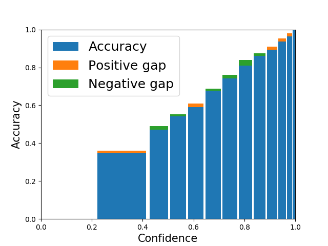
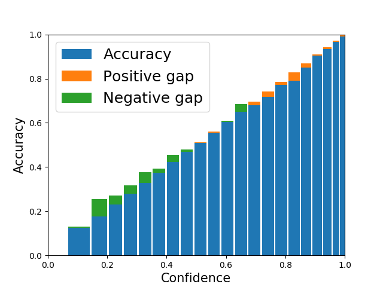
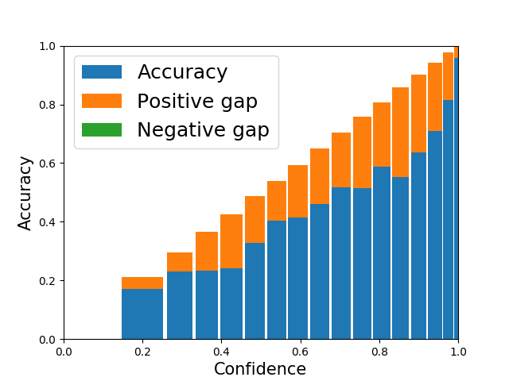
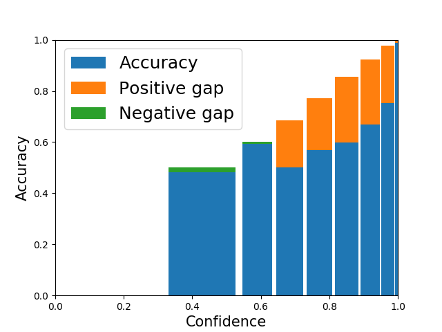

# About adaptive-binning

The standard evaluation methods for confidence calibration of neural networks are Reliability Diagram, ECE and MCE. We found that the conventional binning method used is vulnerable to the undetectable accuracy gap, internal compensation, and inaccurate accuracy estimation. 

We provide a implementation of adaptive-binning as a fix to these issues. You should be able to adopt it to your own project easily. Using adaptive-binning enable a more robust and informative evaluation and diagnosis of the quality of confidence calibration. Please check our paper [Evaluation of Neural Network Uncertainty Estimation with Application to Resource-Constrained Platforms](https://arxiv.org/abs/1903.02050) for detailed discussion.

# How to use it

After a network is trained, do a inference on a set of samples and save the confidence score and the prediction correctness as infer_resuls. Then simply call "AdaptiveBinning(infer_results)" to get the ECE, MCE, Realiability Diagram and more.
```python
Import AdaptiveBinning
# you code to get infer_results
AdaptiveBinning(infer_results)
```
Run "demo.py" for a demonstration.
```sh
python demo.py
```
See more details in demp.py and AdaptiveBinning.py.

A few examples are shown below where ECE and MCE are shown in percentage.


ECE: 0.60

MCE: 3.01


ECE: 1.56

MCE: 7.77


ECE: 10.58

MCE: 30.50


ECE: 3.11

MCE: 25.67

